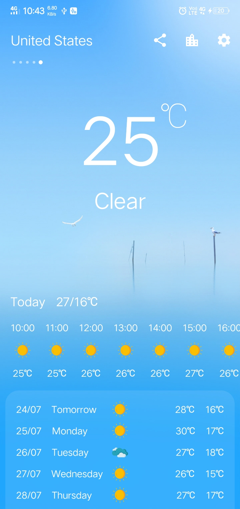
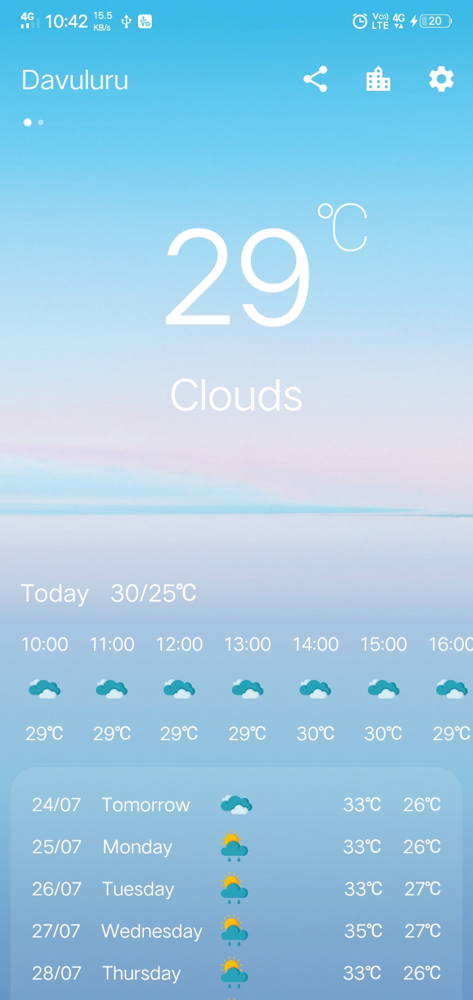
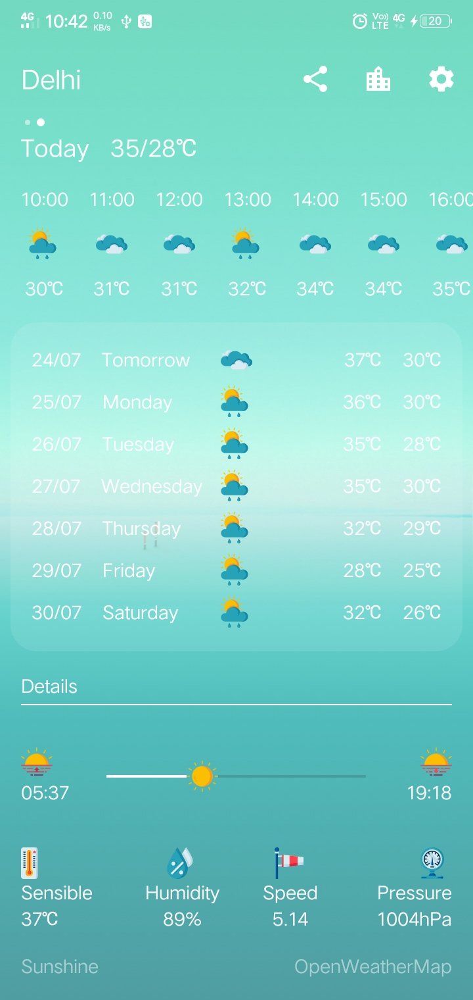
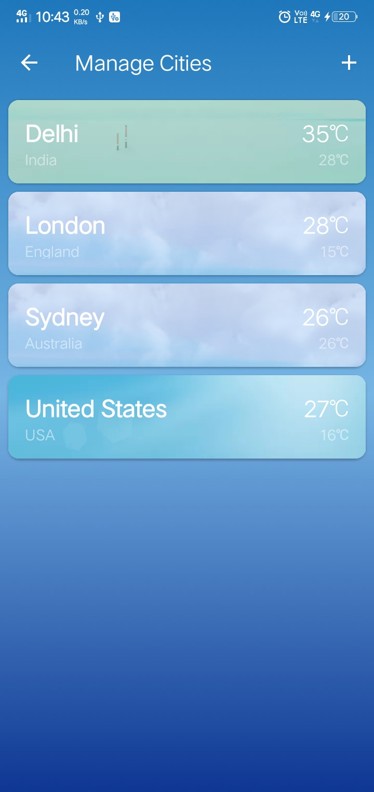
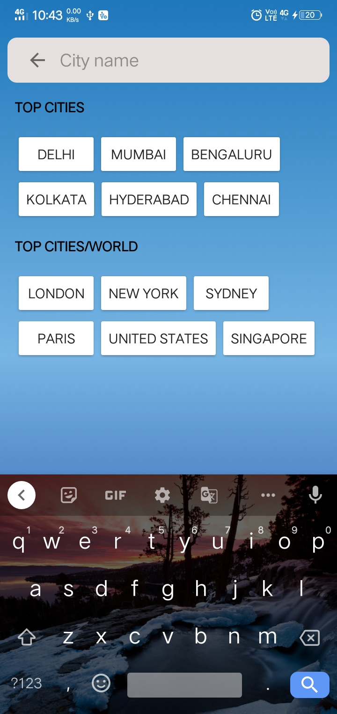
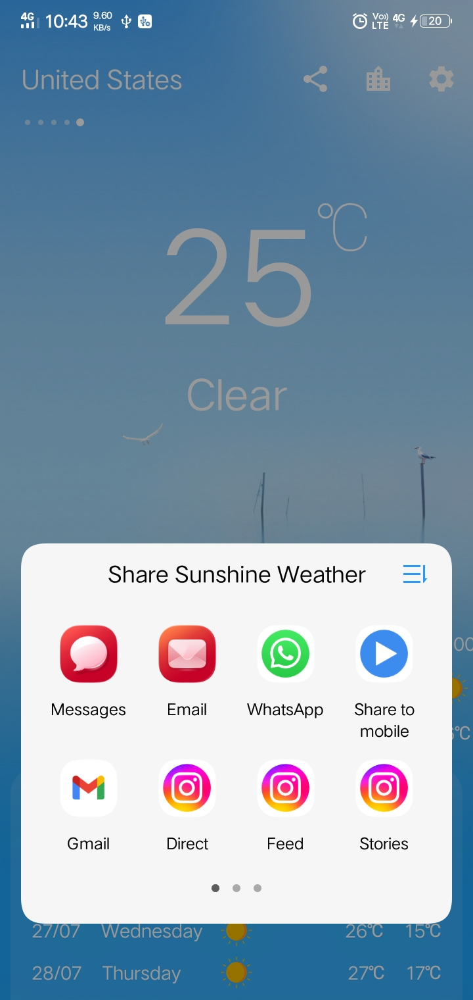

# Sunshine
Sunshine is a simple weather forecasting Android Application. It comes with standard features like daily and hourly forecast along with additional information.

<ul>
  <li> <b>OpenWeatherMap API</b> for fetching weather forecast data.</li>
  <li> <b>SQLite</b> for storing cities in a mobile database.</li>
</ul>

# Screenshots - Weather

  
  
  

# Add Cities and Share Weather

  
  
  

